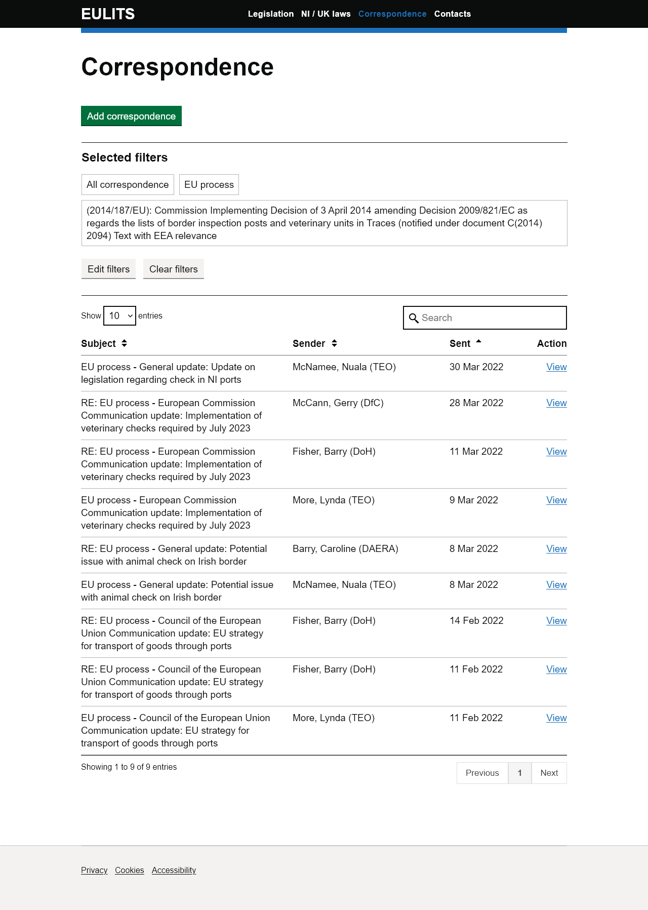

# NIGOV filter list
**Version 1.0.0** 

> This component is currently experimental because more research is needed to validate it.

## When to use it
Use the filter list component to show which filters have been selected in relation to the table below it.

 

## Dependencies
Along with the styles set out in the stylesheet `css/nigov-filter-list.css`, the filter list component uses styles and components from the [GOV.UK design system](https://design-system.service.gov.uk/).

The message list component is compatible with GOV.UK frontend versions 3.14.0.

## Setup
Add the stylesheet `css/nigov-filter-list.css` to your existing GOVUK frontend stylesheet.